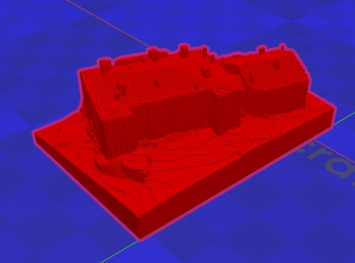

# Impression 3D du Lidar HD

Ce dépôt contient un code qui permet de transformer un fichier de lidar HD en fichier obj, adapté pour l'impression 3D.

## Principe

La zone à modéliser est divisée en voxels. Pour chaque coordonnées (x,y), on regarde l'altitude maximale des points lidar qui s'y trouvent. On remplit les voxels jusqu'à cette altitude maximale.
Le résultat final donne, comme pour Minecraft, un modèle composé de cubes. Si la taille d'impression des cubes est inférieure à 0.5 mm, cette structure en cubes ne se verra plus lors de l'impression.

Comme on obtient un modèle 2.5D, la végétation ne donne pas un bon rendu. Les points lidar utilisés sont ceux classés sol, bâtiment ou non classés.

## Utilisation

Installer la librairie laspy.

Le script à lancer est las_to_obj.py

Paramètres :
* lidar : la dalle de Lidar HD téléchargée sur https://geoservices.ign.fr/lidarhd
* emprise : fichier shapefile contenant l'emprise sur laquelle calculer le modèle
* echelle : l'échelle du modèle. Ce doit être une cha^^ine de caractère de type x/y (par exemple 1/2000)
* resolution : la taille d'un voxel. Idéalement, elle ne doit pas être inférieure à 33 cm car il risque sinon d'y avoir des zones sans points lidar (dont la résolution est de 10 pointspar m2)
* taille_cube : la taille d'un cube lors de l'impression
* taille_maquette : la taille finale de la maquette souhaitée

Si la taille de la maquette est choisie, mais pas l'échelle, alors l'échelle est calculée automatiquement.
Si la résolution n'est pas choisie, mais que l'échelle et la taille des cubes sont choisies, alors la résolution est calculée automatiquement.
